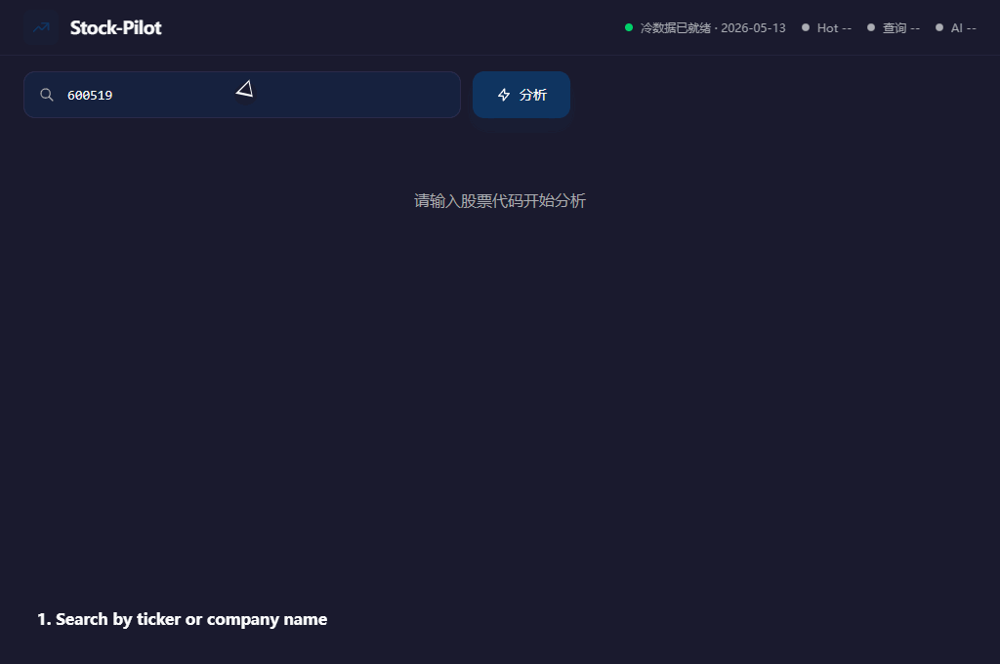

# Stock-Pilot

## Demo



A 股智能分析助手 —— 输入股票代码，实时获取行情与历史数据，自动计算技术指标，调用 LLM 生成专业投资分析。

## 项目架构

```
Stock-Pilot/
├── backend/        FastAPI 后端
│   ├── app/
│   │   ├── api/              API 路由
│   │   ├── ai/               AI 分析层（规则型 + LLM 深度分析）
│   │   ├── analysis/         技术指标计算
│   │   ├── cache/            缓存管理
│   │   ├── collector/        数据收集（实时 + 历史）
│   │   ├── core/             配置
│   │   └── factors/          行业因子系统
│   ├── data/                 本地历史数据（parquet）
│   └── requirements.txt
├── frontend/       Vue 3 + Vite 前端
│   ├── src/
│   │   ├── api/              API 客户端
│   │   └── components/       图表与分析面板
│   └── .env
└── docker-compose.yml
```

## 快速开始

### 1. 克隆与准备

```bash
git clone <repo-url>
cd Stock-Pilot
```

### 2. 后端

```bash
cd backend
python -m venv venv
source venv/bin/activate  # Windows: venv\Scripts\activate
pip install -r requirements.txt
```

创建环境变量文件：

```bash
cp .env.example .env
# 编辑 .env，填入你的 LLM API 配置
```

启动服务：

```bash
uvicorn app.main:app --reload --host 0.0.0.0 --port 8000
```

### 3. 前端

```bash
cd frontend
npm install
```

创建环境变量文件（可选，默认已配置）：

```bash
cp .env.example .env
# 编辑 .env 可修改后端地址
```

启动开发服务器：

```bash
npm run dev
```

前端默认运行在 `http://localhost:5173`，后端在 `http://127.0.0.1:8000`。

### 4. Docker Compose（可选）

```bash
docker-compose up --build
```

## 数据来源

| 类型 | 来源 | 说明 |
|------|------|------|
| 实时行情 | easyquotation（腾讯） | 秒级，TTL 10-30s |
| 历史 K 线 | 本地 parquet（Baostock 格式） | 读取本地 `data/base_market/` |
| 分时数据 | easyquotation | 当日走势 |

## 核心能力

- **实时行情**：最新价、涨跌幅、成交量、市值、PE/PB 等
- **技术指标**：MA5/10/20/30/60、RSI14、MACD
- **AI 快速分析**：基于规则的技术面速评（趋势/信号/支撑/压力）
- **AI 深度分析**：LLM 生成专业研报，含行业因子、核心矛盾、预期差、资金行为、多空触发条件等

## ⚠️ 安全提醒

- 生产环境请务必修改 CORS 白名单（`app/main.py`）
- 不要将 `.env` 文件提交到 Git（已配置 `.gitignore`）
- 若 API Key 曾泄露，请立即在对应平台（如火山方舟）轮换密钥

## 文档

- [API 文档](docs/API.md)

## License

MIT
